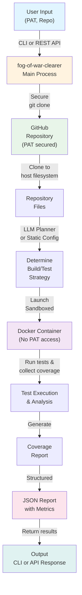

# fog-of-war-clearer

A Go tool that fetches a GitHub repository and performs security and quality
checks — starting with **test-coverage analysis** across TypeScript, JavaScript,
Java, and Kotlin.  Analysis is executed inside sandboxed Docker containers so
that repository code never runs with access to your Personal Access Token (PAT).

---

## Features

| Feature | Detail |
|---|---|
| **CLI** | `fog-of-war-clearer analyze --pat <PAT> --repo owner/name` |
| **REST API** | `POST /api/v1/analyze` |
| **Sandboxed execution** | Every check runs in a sandboxed Docker container with bridged networking and strict resource limits |
| **PAT safety** | The PAT is used only for `git clone` on the host; it is _never_ passed to containers and is scrubbed from all error messages and log output |
| **Structured JSON output** | Both CLI and API return the same `Report` JSON schema |
| **Multi-language coverage** | TypeScript · JavaScript · Java · Kotlin · Go · Rust · PHP |
| **LLM-powered planning** | Optional containerised Ollama agent inspects repo config files to choose the right Docker image and test commands |

---

## How it works



---

## Supported checks

| Check | Flag / JSON key | Default |
|---|---|---|
| Test coverage | `test-coverage` | ✅ yes |

More checks can be added as new `CheckType` values in `pkg/report/report.go`.

---

## Robustness & compatibility

- **npm lockfile fallback** — Repos without `package-lock.json` or `npm-shrinkwrap.json` use `npm install` instead of `npm ci`, ensuring analysis works on any Node.js project.
- **Vitest coverage fix** — Vitest requires `@vitest/coverage-v8` to be explicitly installed for coverage reporting; the tool detects vitest and auto-installs it.
- **Rust version compatibility** — Uses `rust:1-slim` (latest stable) and `cargo install --locked` for pinned dependency versions, ensuring compatibility across Rust versions.
- **Static planner fallback** — When the LLM planner is unavailable or returns invalid output, deterministic built-in defaults guarantee analysis always succeeds.

---

## Quick start

### Prerequisites

- Go 1.24+
- Docker (running daemon)
- A GitHub Personal Access Token with `repo` (read) scope

### Build

```bash
# CLI
go build -o fog-of-war-clearer ./cmd/cli

# API server
go build -o fog-of-war-clearer-server ./cmd/server
```

### CLI usage

```bash
# Analyse a repository (results saved to results/owner-repo_<timestamp>.json)
./fog-of-war-clearer analyze \
  --pat ghp_XXXX \
  --repo owner/repo-name

# Save results to a custom location
./fog-of-war-clearer analyze \
  --pat ghp_XXXX \
  --repo owner/repo-name \
  --output custom/path.json

# Specify which checks to run (comma-separated)
./fog-of-war-clearer analyze \
  --pat ghp_XXXX \
  --repo owner/repo-name \
  --checks test-coverage
```

**Default output behavior:**
By default, results are written to `results/<owner>-<repo>_<ISO8601-timestamp>.json`.
Timestamps allow time-series comparison of coverage trends. The `results/` directory is gitignored.

### API server usage

```bash
# Start the server (defaults to :8080; override with PORT env var)
PORT=9090 ./fog-of-war-clearer-server
```

```http
POST /api/v1/analyze
Content-Type: application/json

{
  "pat":    "ghp_XXXX",
  "repo":   "owner/repo-name",
  "checks": ["test-coverage"]
}
```

The `checks` field is optional and defaults to `["test-coverage"]`.

#### Health check

```http
GET /healthz
→ {"status":"ok"}
```

---

## JSON output schema

```json
{
  "repo":   "owner/repo-name",
  "run_at": "2024-01-01T12:00:00Z",
  "checks": [
    {
      "type":   "test-coverage",
      "status": "success",
      "coverage": [
        {
          "language":   "typescript",
          "lines":      85.5,
          "statements": 86.0,
          "branches":   72.0,
          "functions":  90.0
        }
      ]
    }
  ]
}
```

`status` is one of `success`, `failure`, or `skipped`.
On failure, an `error` field is present with a sanitised message (PAT redacted).

---

## Security design

### PAT handling
- The PAT flows only through `git clone` on the **host** process.
- `GIT_TERMINAL_PROMPT=0` and `GIT_ASKPASS=echo` prevent interactive credential prompts.
- Any error message or log line that might contain the PAT is scrubbed before it is returned or written anywhere.

### Sandboxed containers
- Network mode is `bridge` to allow package installation; the PAT is never forwarded to containers.
- The repository is mounted **read-only** at `/repo`.
- A separate, writable workspace directory is mounted at `/workspace`; it is deleted after the container exits.
- Containers run with `no-new-privileges`, 2 GiB memory cap, and 2 CPU quota.
- Containers are force-removed after they exit.

### Input validation
- `repo` must match `^[A-Za-z0-9_.\-]+/[A-Za-z0-9_.\-]+$` — no path traversal, no shell metacharacters.
- API request bodies are limited to 1 MiB to prevent DoS.
- `npm ci --ignore-scripts` is used for JavaScript/TypeScript to prevent lifecycle script execution.

---

## Project structure

```
.
├── cmd/
│   ├── cli/          # CLI entry point
│   └── server/       # API server entry point
├── internal/
│   ├── api/          # HTTP handlers
│   ├── checker/      # Analysis pipeline orchestrator
│   ├── coverage/     # Language detection + coverage parsers + analyzer
│   ├── fetcher/      # Git clone with PAT
│   ├── planner/      # LLM + static planners (Docker image & script selection)
│   └── runner/       # Docker sandbox runner
└── pkg/
    └── report/       # Shared JSON output types
```

---

## Running tests

```bash
go test ./...
```

Integration tests that actually spin up Docker containers are excluded from the
default test run.  They can be enabled with `-tags integration` once the target
Docker images are available locally.

---

## Environment variables

| Variable | Default | Description |
|---|---|---|
| `FOG_PAT` | _(none)_ | GitHub Personal Access Token (CLI also accepts `--pat`) |
| `FOG_REPO` | _(none)_ | Repository to analyse (CLI also accepts `--repo`) |
| `FOG_CHECKS` | `test-coverage` | Comma-separated checks to run |
| `FOG_LLM_MODEL` | _(unset)_ | Ollama model tag — set to enable the LLM planner (e.g. `qwen2.5:1.5b`) |
| `FOG_LLM_OLLAMA_IMAGE` | `ollama/ollama:latest` | Docker image for the Ollama server container |
| `PORT` | `8080` | TCP port the HTTP server listens on (server only) |
| `DOCKER_HOST` | _(system default)_ | Override the Docker socket path |

### LLM planner

When `FOG_LLM_MODEL` is set, the tool spins up two containers on an ephemeral
Docker bridge network before running the analysis:

1. **Ollama container** — runs the LLM inference server.  Model weights are
   cached in a Docker volume (`fog-ollama-models`) so they are only downloaded
   on the first run.
2. **Script container** — a lightweight Alpine helper container used to query
   the Ollama server during planning.

The planner reads the cloned repository's config files on the host, sends the
relevant context to Ollama via the helper container, and uses the response to
determine the optimal Docker image and test commands for each detected
language.

Both containers are torn down after planning completes.  If the LLM is
unavailable or returns an invalid plan, the tool falls back to built-in static
defaults automatically.

The recommended model for this task is `qwen2.5:1.5b` (~900 MB), which is small
enough to run on a laptop CPU.

**Parallel execution:**
Multiple `fog-of-war-clearer` processes can run concurrently on different repositories.
Each run is fully isolated — containers, networks, and temporary directories are unique per run.
The shared model volume uses a check-before-pull optimisation: after the first run, subsequent
runs usually find the cached model and skip the pull entirely, avoiding repeated model downloads.
Planning may still be briefly coordinated on the same host while the Ollama environment is
prepared; once the model is cached, concurrent runs proceed independently.
